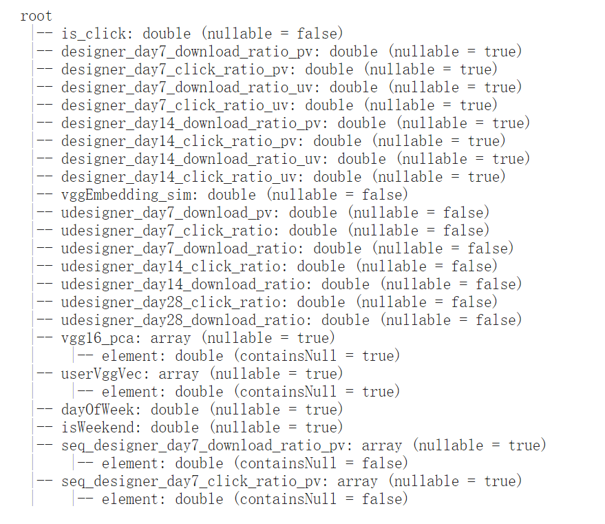

#该代码使用的数据集，是在网络上搜集得到的公开数据，与所在工作公司无关，特此声明

该数据集共分为三个部分，商品特征，用户序列特征，其他特征(包括但不限于，用户画像，上下文特征等，由于不需要和商品特征做注意力机制计算，统称为其他)

其中商品特征包括了商品的基础特征。在用户序列的个数，应该和商品特征个数保持一直

具体的特征情况见下图，特征的生成是由spark任务保存成的tfrecord格式的数据
